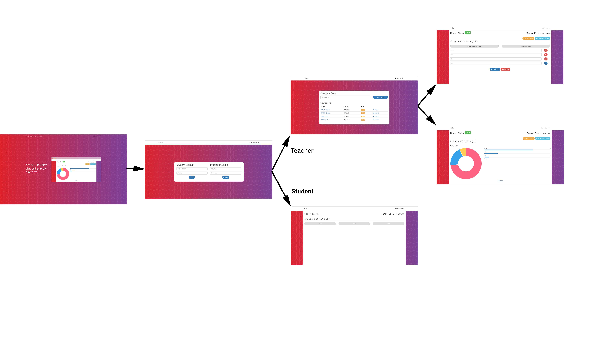

# TWEB - KWizz
## Authors
Laureline David & Yves Athanasiadès

## Technologies / frameworks
  * Angular2
  * Bootstrap
  * Silex
  * Twig
  * PHP
  * .Net MVC

## Navigation


## Instructions
Be sure to have a functional docker(v1.12.x) installation

Then execute the commands below in a chosen directory

```
git clone https://github.com/ltouroumov/tweb-kwizz.git

docker-compose up
```

## Link
[http://kwizz.synergy-net.ch](http://kwizz.synergy-net.ch/)